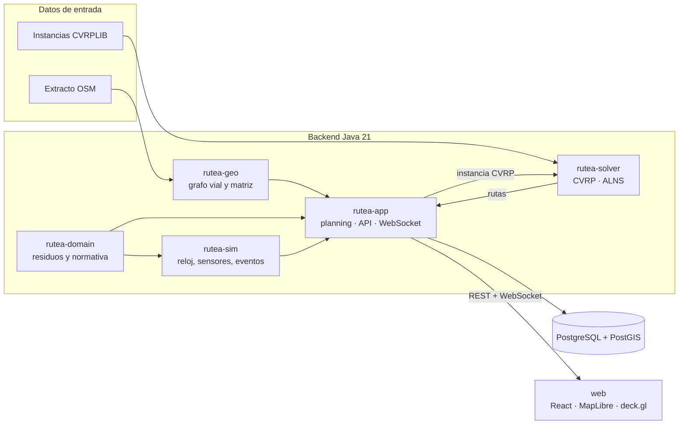
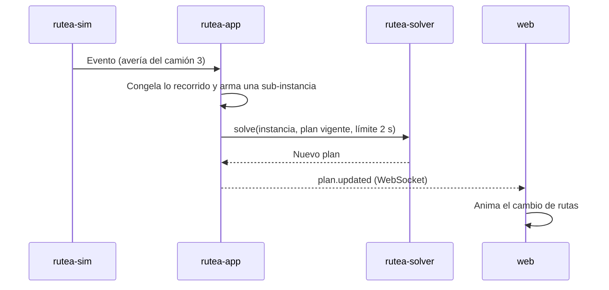

# Arquitectura

Rutea es un **monolito modular**: módulos Maven con fronteras claras y dependencias en una sola dirección, desplegados como un solo proceso. Ver [ADR 0001](adr/0001-monolito-modular.md).

## Vista general

## Módulos

### rutea-solver

Java puro, sin dependencias en tiempo de ejecución.

- `model`: `Instance` (capacidad, demandas, matriz), `DistanceMatrix` (enteros, arreglo plano), `Solution` (rutas como `int[]`).
- `io`: lectura de `.vrp` y `.sol` de CVRPLIB.
- `eval`: `Evaluator`, la única fuente de verdad del costo y la factibilidad.
- `api`: interfaz `Solver` y `SolveOptions` (semilla, límite de tiempo).
- `baseline`: solver de referencia por vecino más cercano.
- `bench`: arnés que corre un solver sobre un directorio de instancias y escribe CSV.
- Más adelante: `construct` (Clarke-Wright), `local` (búsqueda local), `alns`.

### rutea-domain

- `WasteStream`: corrientes de residuo con su color oficial.
- `NormRef`: referencia normativa (norma, artículo, URL, estado de verificación).
- `CollectionRules`: reglas del Decreto 1077 de 2015 que el planificador debe respetar.
- Más adelante: `Container`, `Vehicle`, `Facility` (base, ECA, relleno), `Shift`.

### rutea-geo (F3)

Grafo vial en arreglos compactos (CSR), Dijkstra y A*, y construcción de la matriz de distancias y tiempos.

### rutea-sim (F5)

Reloj acelerable, sensores de llenado y generador de eventos. Publica en un bus interno que consume `rutea-app`.

### rutea-app

Spring Boot. Paquetes:

- `planning`: traduce el problema de residuos a instancias CVRP y las rutas de vuelta a geometrías.
- `api`: REST (`/api/...`) y WebSocket.
- `persistence`: PostgreSQL + PostGIS (desde F6).

## Flujo de una replanificación (F5)

